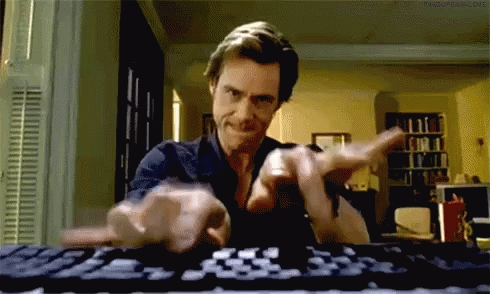

# FIGHTING GAME

This challenge started out being very ambitious. Between the little time and the difficulties that I have faced, I have made a rather regrettable code, but it is functional and meets the specifications and I hope to improve it later if I have time for it.

## Index

- [Gratitude](#gratitude).
- [Development](#development).
- [Technology](#technology).
- [Documentation](#documentation).
- [Functioning](#functioning).
- [Deploy](#deploy)

## Gratitude

In this challenge, I have to thank the great help that many colleagues have given me, especially [Álvaro](https://github.com/Alvaro-78), [Carlos](https://github.com/Carlos-Val), [Diego](https://github.com/diegogb-08) and [Joan](https://github.com/joanbatiste). For those long nights "picando código".

## Development

### Technology

- JavaScript (high percentage).
- HTML.
- CSS.

### Documentation

- To do the random luck I documented [here](https://developer.mozilla.org/en-US/docs/Web/JavaScript/Reference/Global_Objects/Math/random). This is the part of the code: 
~~~~
const getRandomArbitrary = (min, max) => {
    return Math.floor(Math.random()) * (max - min) + min;
}
let fluke = getRandomArbitrary(1,rival.luck);
~~~~

- To make the progress bar of life I documented [here](https://developer.mozilla.org/es/docs/Web/HTML/Elemento/progress). This is the part of the code:
~~~~
<progress id="healthPlayer1" value="200" max="200" min="0"></progress>
~~~~

- To put audio I documented [here](https://developer.mozilla.org/es/docs/Web/HTML/Usando_audio_y_video_con_HTML5). This is the part of the code:
~~~~
<audio src="./audio/Pokemon_Gold_Silver_Battle.mp3" autoplay></audio>
~~~~

- To restart the app I documented myself [here](https://developer.mozilla.org/es/docs/Web/API/Location/reload) and [here](https://developer.mozilla.org/es/docs/Web/API/Window). This is the part of the code:

JS:
~~~~
const reset = document.getElementById('reset');
reset.addEventListener('click', () => {
    alert('Game over... loadding');
    window.location.reload();
})

~~~~

HTML:
~~~~
    

        <button class="reset" id="reset">Game Over</button>
    

~~~~

- I found and documented how to put different fonts [here](https://fonts.google.com/specimen/Press+Start+2P?query=star&preview.text_type=custom&sidebar.open=true&selection.family=Lobster|Playfair+Display+SC|Press+Start+2P#glyphs).

### Functioning

The operation is simple. You press start, choose three characters per teams and then attack. To listen to the music you have to allow automatic playback in your browser. Simple for so many hours.

## Deploy

The fighting game I have deployed on GitHub page. [Here](https://devian5.github.io/fightingGame/) you can see the final result of the project.

[up](#FIGHTING-GAME)